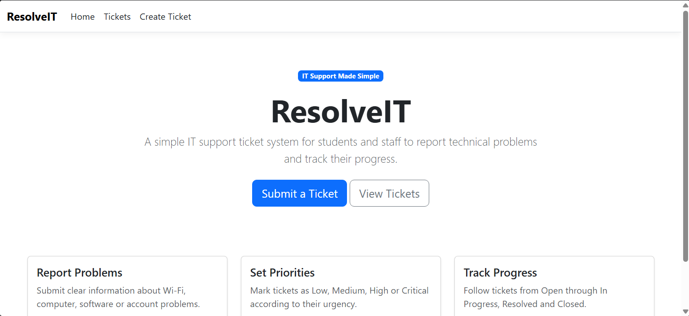
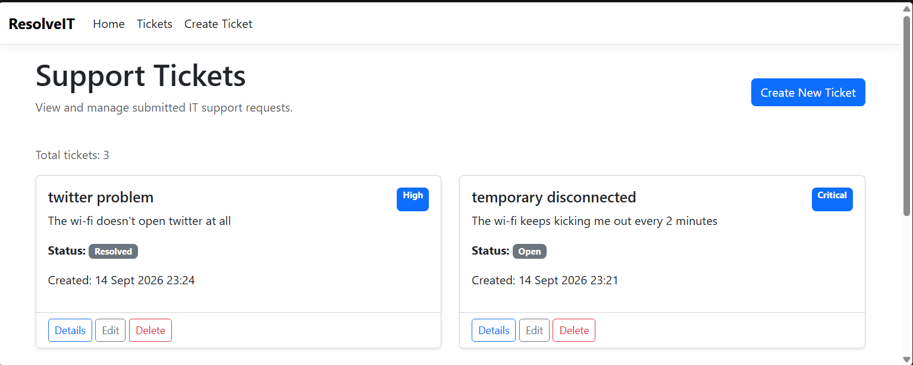
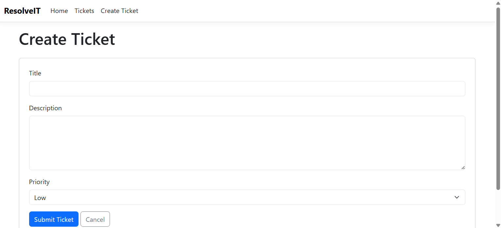
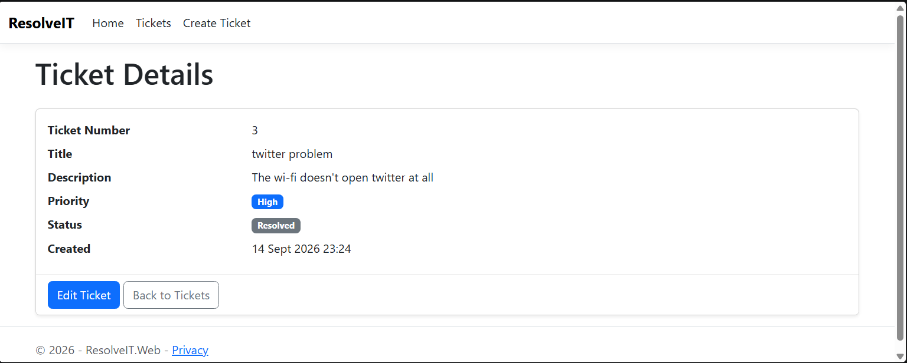

# ResolveIT

ResolveIT is a web-based IT support ticket management system built with ASP.NET Core MVC. It provides a structured way to create, view, update, track, and delete technical support requests.

## Problem

Technical support requests are often submitted through scattered emails or messages, making them difficult to monitor and resolve. ResolveIT keeps support requests in one system, where their priority, status, details, and progress can be managed clearly.

## Current Features

* Create IT support tickets.
* Add a title, description, and priority.
* Validate required information before submission.
* View all submitted tickets.
* Display the newest tickets first.
* View the full details of an individual ticket.
* Edit ticket information, priority, and status.
* Delete tickets with a confirmation page.
* Track tickets through statuses such as Open, In Progress, Resolved, and Closed.
* Store ticket information persistently in a SQLite database.
* Display a responsive user interface using Razor views and Bootstrap.

## Screenshots

### Home Page



### Support Tickets



### Create Ticket



### Ticket Details



## Technology Stack

* C#
* .NET 10
* ASP.NET Core MVC
* Razor views
* Entity Framework Core
* SQLite
* HTML and CSS
* Bootstrap
* Git and GitHub

## How ResolveIT Works

1. A user creates a support ticket describing a technical problem.
2. The ticket is saved to the SQLite database.
3. Submitted tickets appear on the Support Tickets page.
4. Ticket information, priority, and status can be updated.
5. Users can view ticket details or delete tickets when necessary.

## Getting Started

### Requirements

* .NET 10 SDK
* Git
* Entity Framework Core command-line tools

Install the Entity Framework Core tools if they are not already installed:

```powershell
dotnet tool install --global dotnet-ef
```

### Run the Project

Clone the repository:

```powershell
git clone https://github.com/Azile-cell/Resolve-IT.git
```

Open the project directory:

```powershell
cd Resolve-IT\ResolveIT.Web
```

Restore the required packages:

```powershell
dotnet restore
```

Create or update the SQLite database:

```powershell
dotnet ef database update
```

Run the application:

```powershell
dotnet run
```

Open the local address displayed in the terminal.

## Project Structure

* `Controllers` - handles ticket requests and application actions.
* `Models` - defines ticket information, priorities, and statuses.
* `Views` - contains the Razor pages displayed to users.
* `Data` - contains the Entity Framework Core database context.
* `Migrations` - contains the database schema history.
* `wwwroot` - contains CSS, JavaScript, and other static files.

## Future Improvements

* User authentication and role-based access.
* Separate requester, support-agent, and administrator accounts.
* Assign tickets to support agents.
* Add ticket categories.
* Add comments and resolution notes.
* Search and filter tickets.
* Create a support dashboard and reports.
* Add IT asset management.
* Add automated tests.
* Deploy the application online.

## Project Status

ResolveIT currently has a functional ticket-management MVP with persistent SQLite database storage. Additional service-desk features are planned for future development.

## Author

Developed by [Azile Gomomo](https://github.com/Azile-cell).
